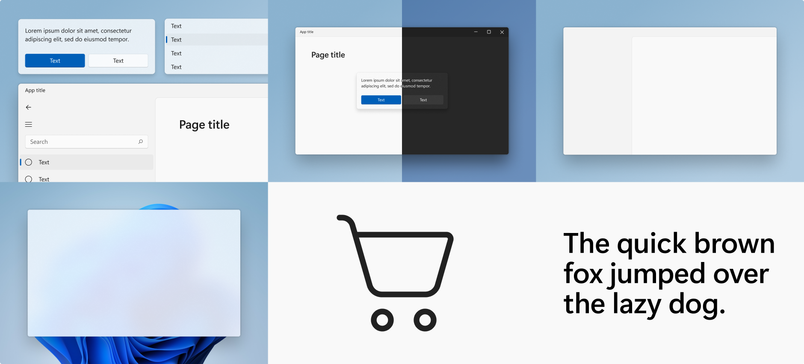
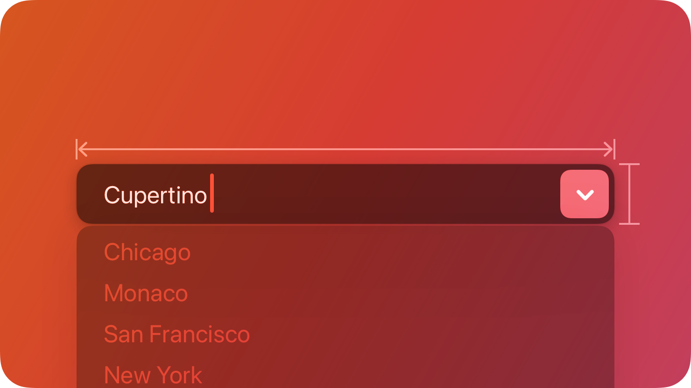

# Ergonomy and Standards

## Human Interface Guidelines for OSes

### Windows

- Windows has its own set of guidelines called the "Microsoft Design Guidelines" or "Windows User Experience Interaction Guidelines."
- The guidelines focus on providing a consistent and intuitive user experience across Windows devices and applications.
- Windows emphasizes a design language called "Microsoft Fluent Design System," which includes principles like depth, motion, and material.
- The HIG covers various aspects such as layout, typography, color, icons, controls, navigation, and accessibility.
- It provides recommendations for designing apps for different form factors like desktop, tablets, and smartphones.

### Apple

- Apple provides human interface guidelines specifically for their platforms, including iOS, macOS, watchOS, and tvOS.
- The guidelines focus on creating a seamless and intuitive experience for Apple users.
- Apple's HIG emphasizes a design language called "Human Interface Design" or "Human Interface Guidelines."
- The guidelines cover topics such as app architecture, navigation, controls, gestures, typography, color, and iconography.
- Apple places a strong emphasis on consistency, simplicity, and a minimalistic design approach across their platforms.

### Linux

- Linux is an open-source operating system with multiple distributions, and as such, it doesn't have a centralised HIG like Windows or Apple.
- Different Linux distributions may have their own guidelines, but they are not universally standardised.
- Linux encourages flexibility and customisation, allowing users to personalise their interface and experience.
- Many Linux distributions provide design guidelines or recommendations specific to their desktop environments, such as GNOME, KDE, or XFCE.
- These guidelines typically focus on usability, accessibility, and consistency within the specific desktop environment.

### Summary

Overall, while Windows and Apple have centralised and specific HIGs, Linux's approach is more fragmented due to its open-source nature and multiple distributions. However, individual Linux distributions often have their own guidelines for their respective desktop environments to ensure a consistent and user-friendly experience.

## 10 Rules of Good UI Design

Youtube creator elegant themes presents 10 Rules of good UI design to follow:

1. Make everything the user needs readily accessible: Ensure that users can easily find the tools, options, and information they require.
2. Be consistent: Maintain consistency in menus, layouts, fonts, and designs throughout the website or application.
3. Be clear: Eliminate clutter and confusion by clearly indicating the purpose of each page or section. Guide users through different steps or pages.
4. Give feedback: Provide visual or auditory feedback to inform users about their actions, such as button presses or file uploads.
5. Use recognition, not recall: Design the interface so that users can recognize and understand its elements without having to recall information or think too much.
6. Choose how people interact: Design the interface based on how users are likely to interact with it, ensuring consistency and intuitive interactions.
7. Follow design standards: Adhere to established design standards and conventions to make it easier for users to understand and navigate the interface.
8. Elemental hierarchy matters: Organize elements on the page in a hierarchical manner, with important functions prominently placed. Utilize white space effectively.
9. Keep things simple: Simplify the interface by removing unnecessary elements or steps, reducing friction for users.
10. Keep users free and in control: Design the interface in a way that empowers users, allowing them to easily perform actions and providing options to revert or undo actions.

## Comparing help pages

### Criteria
To simplify the comparison process, i will use 3 criteria to measure how good the help pages are.

#### Visual aids
Are there visual elements such as images or symbols that make the navigation of help menus easier and more intuitive?

#### Amount of Information
Is there enough Information to actually be helpful?

#### Access to Support
Is there easy access (not hidden 10 links deep) to support if the problem is not solved by using the help pages?

### Spotify

#### Visual aids

Yes, Images display the content a certain help page should contain. Only on the first page however. Once you go one deeper, there is only text and little visual differentiation between the subtopics.

#### Amount of Information

The Information is detailed but not overbearingly.

#### Access to Support

At the bottom of the page you can go to the "contact us" page. There you have more alternatives and you can message Spotify directly, though you have to log in first.

### TBZ

#### Visual aids

No real visual aids. Text ist too big and does not scale to the screen.

#### Amount of Information

Information is ok. Detailed when it comes to the most relevant topics.

#### Access to Support

You can go to "contact us" and you'll find telephone number and email.

## UI Accessibility

Accessibility in UI design refers to the practice of creating user interfaces that are inclusive and usable by a wide range of people, including those with disabilities or impairments. It aims to remove barriers and provide equal access to information, functionality, and interaction for all users, regardless of their abilities.

### Examples

1. Keyboard Accessibility: Ensure that all interactive elements and functionality can be accessed and operated using the keyboard alone. This is important for users who have mobility impairments and cannot use a mouse or touch input. It involves providing keyboard focus indicators, logical tab order, and support for keyboard shortcuts.

2. Screen Reader Compatibility: Make sure that the UI is compatible with screen reader software, which reads aloud the content of the interface for users with visual impairments. This involves using semantic HTML, providing alternative text for images, and ensuring that important information is conveyed in a structured and meaningful way.

3. Color Contrast: Use sufficient color contrast between foreground and background elements to ensure readability for users with visual impairments or color blindness. This includes maintaining a contrast ratio that meets accessibility standards, such as WCAG (Web Content Accessibility Guidelines).

4. Text Alternatives for Non-Text Content: Provide descriptive alternative text for non-text content, such as images or icons. This allows users with visual impairments or those using assistive technologies to understand the meaning and purpose of the visual elements.

5. Clear and Consistent Navigation: Design intuitive and consistent navigation patterns throughout the UI. Use descriptive labels and provide clear indications of the user's current location within the interface. This helps users with cognitive disabilities or those using screen readers to navigate and understand the UI structure easily.

6. Captions and Transcripts: For multimedia content, such as videos or audio, provide captions or transcripts. This benefits users with hearing impairments who may rely on captions to understand the content.

7. Responsive and Scalable Design: Ensure that the UI layout adapts and scales appropriately across different devices and screen sizes. This benefits users with visual impairments or those who prefer to customize their display settings, such as increasing text size.

8. Error Handling and Validation: Provide clear and descriptive error messages when users encounter form validation issues or other errors. Assistive technologies should be able to identify and communicate these messages to users accurately.

These examples illustrate some of the ways accessibility can be implemented in UI design. By considering the diverse needs of users, UI designers can create interfaces that are inclusive and provide a positive user experience for everyone.

## Personas for a calendar application

#### Persona: Anna - Busy Professional

- Background: A working professional with a demanding schedule and multiple responsibilities.
- Goals: Efficiently manage appointments, meetings, and deadlines. Prioritize tasks and maintain a balanced work-life schedule.
- Pain Points: Overlapping appointments, difficulty in rescheduling, and staying organized amidst a busy schedule.
- Needs: Intuitive user interface, seamless integration with other productivity tools, reminders and notifications, and the ability to easily share calendars with colleagues.

#### Persona: Student

- Background: A college student with a packed schedule of classes, assignments, and extracurricular activities.
- Goals: Stay on top of academic deadlines, manage study groups and project meetings, and balance personal commitments.
- Pain Points: Time conflicts between classes and extracurricular activities, assignment due dates, and remembering exam schedules.
- Needs: Color-coded categories for different activities, reminders for assignments and exams, integration with student email and learning management systems, and the ability to set recurring events for regular study sessions.

#### Persona: Event Planner

- Background: A professional event planner responsible for organizing conferences, meetings, and social events.
- Goals: Coordinate multiple events, manage event budgets and timelines, and collaborate with event stakeholders.
- Pain Points: Juggling between different events, managing guest lists, and ensuring all logistical details are in place.
- Needs: Ability to create and manage multiple calendars for different events, guest RSVP tracking, event-specific task lists, customizable event templates, and integration with event management tools or services.

#### Persona: Fitness Enthusiast

- Background: A health-conscious individual who follows a regular exercise routine and participates in fitness classes and events.
- Goals: Maintain a workout schedule, track progress, and receive reminders for fitness classes and upcoming events.
- Pain Points: Difficulty in finding suitable fitness classes, scheduling workouts around other commitments, and tracking progress.
- Needs: Integration with fitness tracking apps or wearables, ability to set fitness goals and track achievements, find nearby fitness classes or facilities, and receive reminders for upcoming classes or personal workouts.

#### Persona: Family Organizer

- Background: A parent responsible for managing family schedules, appointments, and activities.
- Goals: Coordinate family members' schedules, manage children's school and extracurricular events, and plan family outings.
- Pain Points: Conflicting schedules, keeping track of children's activities, and ensuring everyone is informed about important events.
- Needs: Shared family calendar with individual profiles, color-coded categories for different family members, ability to set reminders and notifications, recurring events for routine activities, and the option to sync with other family members' calendars.